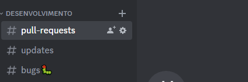

<a id="readme-top" name="readme-top"/>

<!-- PROJECT LOGO -->
<br />

<div align="center"  width="40vw"  height="30vw">
  <a href="https://github.com/gebraz/ppgs_labprog2023">
    
  </a>
  <h3 align="center">sPPg - Sistema de Acompanhamento de Produção - PPG </h3>
</div>

<!-- TABLE OF CONTENTS -->
<details>
  <summary>Índice</summary>
  <ol>
    <li>
      <a href="#about-the-project">Sobre</a>
    </li>
    <li>
      <a href="#getting-started">Getting Started</a>
      <ul>
        <li><a href="#prerequisites">Pré-Requisitos</a></li>
        <li><a href="#installation">Instalação</a></li>
      </ul>
    </li>
    <li><a href="#usage">Uso</a></li>    
    <li><a href="#contributing">Contribuição</a></li>
    <li><a href="#license">License</a></li>
    
  </ol>
</details>

<!-- ABOUT THE PROJECT -->

## Sobre

[![Product Name Screen Shot][product-screenshot]](https://example.com)

Projeto desenvolvido na disciplina de Laboratório de Programação - UFMA.

Sistema desenvolvido: monitoramento e coleta de estatísticas de produção de docentes em pós graduação de Ciência da Computação - UFMA.

Objetivos:

- Gerar estatísticas de produção de docentes vinculados a programa de pós
- Administrar informações ao longo do tempo para subsidiar decisões dos programas.

### Pré-requisitos

- [Git](https://git-scm.com/)
- [Java](https://www.java.com/pt-BR/)
- [SpringBoot3](https://spring.io/)
- [VS Code](https://code.visualstudio.com/)

### Instalação

- Usando Git Bash:

Com o Git Bash instalado basta escolher um diretorio apertar com o botão direito do mouse e clicar em Git Bash. Como no exemplo abaixo:


Após o tê-lo aberto basta seguir os seguintes passos:

```bash
# Clonando o repositório
$ git clone https://github.com/gebraz/ppgs_labprog2023.git

# Acessando a pasta do repositório
$ cd ppgs_labprog2023

# Abrindo o diretório no VSCode
$ code .

```

- Usando o Git GUI:
  > TODO: Caso alguém use por favor adicionar aqui

## Uso

### Backend

Acesse o arquivo [README](./backend/README.md).

### Frontend

Acesse o arquivo [README](./frontend/README.md).

<!-- CONTRIBUTING -->

## Contribuição

Se você tiver uma sugestão para melhorar isso, fork o repositório e crie uma pull request. Você também pode simplesmente abrir um problema com a tag "melhoria".
Não se esqueça de dar uma estrela ao projeto! Obrigado novamente!

### Fazendo um Fork

1. Fork o projeto
2. Crie sua feature branch (`git checkout -b feature/AmazingFeature`)
3. Commit suas alterações (`git commit -m 'Add some AmazingFeature'`)
4. Push para a branch (`recurso de origem do git push/AmazingFeature`)
5. Abra uma solicitação pull

<p align="right">(<a href="#readme-top">back to top</a>)</p>

<!-- LICENSE -->

## Pull Requests

Após ser feito o pull-request por favor envie o link dele na aba pull-requests no discord oficial do repositório. Caso não tenha acesso ao Discord basta pedir para um dos colaboradores.


## License

<!-- CONTACT -->

## Contact
